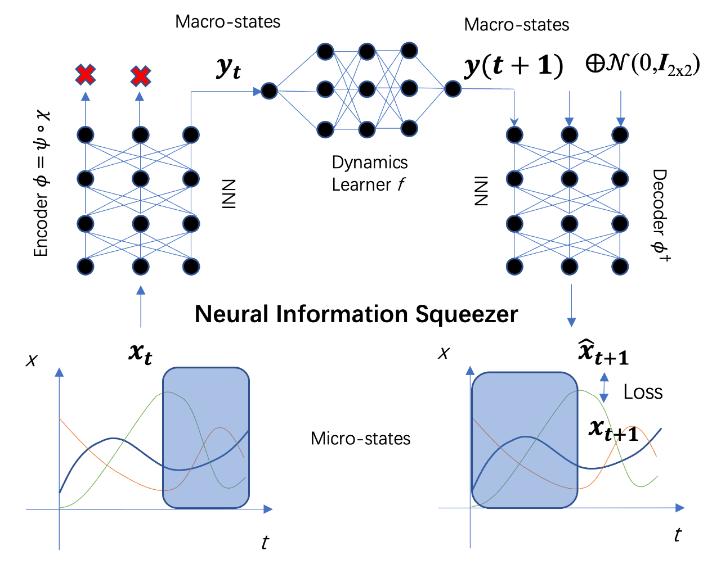
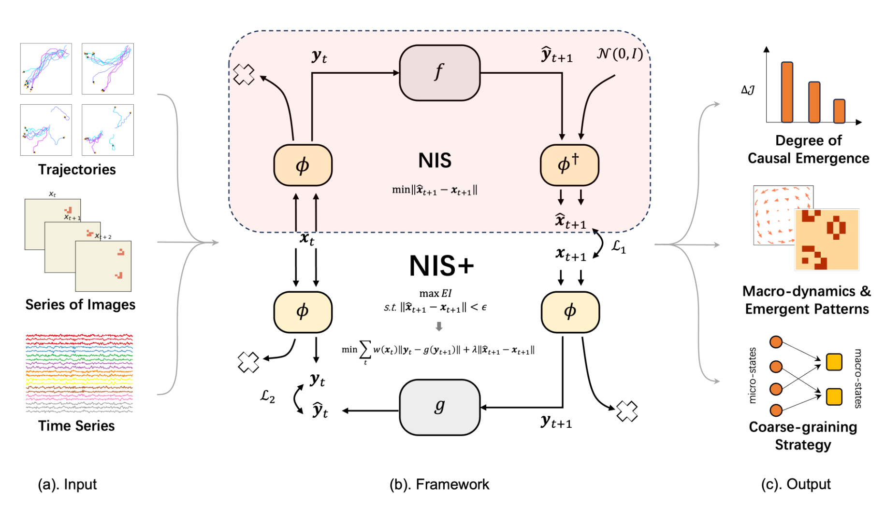

The Neural Information Squeezer (NIS) is a machine learning framework designed for identifying causal emergence within datasets. Causal emergence represents a theoretical construct that aims to quantify the emergence phenomena within complex systems[1]. Given that the underlying mechanisms of the data are often obscure, and that abundant data can be procured through observation, a machine learning framework is of considerable significance in the study of complex systems, particularly with respect to their emergent characteristics.

NIS：
It represents the original framework of this series[2]. In the context of multi-scale modeling, we employ an encoder to project micro-data onto a macro latent space, which is composed of an Invertible Neural Network (INN) and a projection mechanism. Subsequently, macro-states are forecasted through a dynamics learner denoted as f. During the decoding phase, we introduce a normal distribution to augment its dimensionality. This enables us to compute the discrepancy between predictions and actual targets at the micro-level.

NIS+：  
However, the NIS does not address the optimization of effective information within macro dynamics. Following the demonstration of certain mathematical theories, we have introduced an enhanced framework, denoted as NIS+, designed to identify causal emergence by maximizing the effective information. Given multivariable time series as inputs, it is capable of outputting the degree of causal emergence, the optimal coarse-graining strategy, as well as the macro-dynamics or emergent patterns. Further details can be found in reference [3].

RNIS：
The framework is currently under investigation.

[1]Yuan, B., Zhang, J., Lyu, A., Wu, J., Wang, Z., Yang, M., Liu, K., Mou, M., & Cui, P. (2024). Emergence and Causality in Complex Systems: A Survey of Causal Emergence and Related Quantitative Studies. Entropy, 26(2), 108. https://doi.org/10.3390/e26020108
[2]Zhang, J., & Liu, K. (2022). Neural Information Squeezer for Causal Emergence. Entropy, 25(1), 26. https://doi.org/10.3390/e25010026
[3]Yang, M., Wang, Z., Liu, K., Rong, Y., Yuan, B., & Zhang, J. (2023). Finding emergence in data by maximizing effective information (arXiv:2308.09952). arXiv. http://arxiv.org/abs/2308.09952

