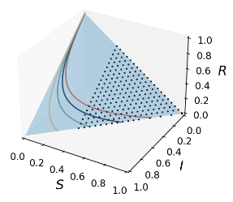

The first experiment revolves around the SIR (Susceptible, Infected, and Recovered or Died) model, a simple dynamical system. In this experiment, the SIR dynamics serve as the ground truth for the macro-level dynamics, while the micro-level variables are generated by introducing noise to the macro-variables. The primary objective is to evaluate our model’s ability to effectively remove noise, uncover meaningful macroscopic dynamics, identify CE, and demonstrate generalization beyond the distribution of the training dataset.  

The figure shows the phase space of the SIR model, along with four example trajectories with the same infection and recovery or death rates. The full dataset (blue area) and the partial dataset (dotted area) used for training are also displayed, consisting of 63,000 and 42,000 uniformly distributed data points, respectively.  

# Introduction
SIR simple example: The case code for training the NIS and NIS+ frameworks using neural network modules. 
SIR EI and multistepmae: Repeated experiments for calculating EI and out-of-distribution generalization in multistep forecasting.  
SIR vector field: A comparison of the vector fields in phase space for NIS and NIS+. 
SIR noise changes: Experiments calculating the variations in EI and CE under different noise levels.  
SIR VAE: Experiments training VAE models.  
train.py: The function used for training. 
dynamic_models_sis_new.py: The function file for generating SIR data. 
vector_field.py: The functions used for plotting vector fields. 
mdl_data: The directory storing the trained model parameters.  
resources: The image files.  

